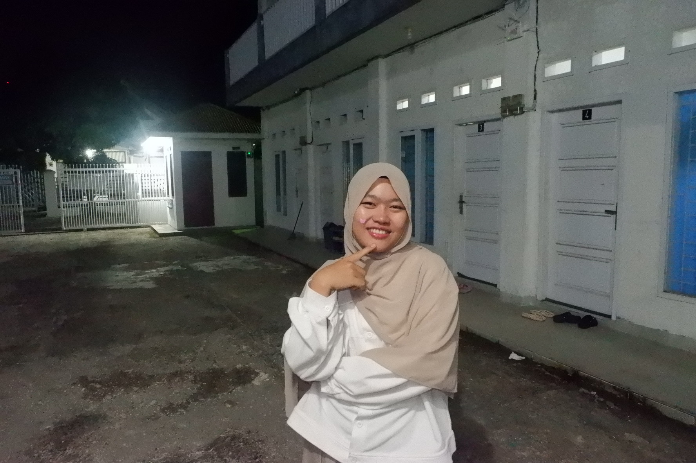

# 🌟 Portfolio Khairunnisa

Website portfolio profesional untuk fresh graduate S1 Teknik Informatika.

---

## 📁 Struktur Proyek

```
portfolio-khairunnisa/
├── frontend/
│   ├── index.html          ← Halaman utama portfolio
│   ├── css/
│   │   └── style.css       ← Seluruh styling
│   ├── js/
│   │   └── main.js         ← Interaktivitas & koneksi API
│   └── assets/
│       └── CV_Khairunnisa.pdf  ← Letakkan CV Anda di sini
│
└── backend/
    ├── server.js           ← Entry point Express server
    ├── package.json        ← Dependencies Node.js
    ├── .env.example        ← Template environment variables
    ├── config/
    │   ├── database.js     ← Konfigurasi MySQL pool
    │   └── schema.sql      ← Skema & seed database
    ├── middleware/
    │   └── auth.js         ← Verifikasi JWT
    └── routes/
        ├── contact.js      ← API form kontak + email notifikasi
        └── index.js        ← API projects, skills, auth, stats
```

---

## ⚙️ Persyaratan

| Tool | Versi Minimum |
|------|--------------|
| Node.js | 18.x |
| npm | 9.x |
| MySQL | 8.0 |
| VS Code | 1.117.0 |

---

## 🚀 Cara Setup — Langkah demi Langkah

### 1. Siapkan Database MySQL

Buka MySQL Workbench atau terminal, lalu jalankan:

```bash
mysql -u root -p < backend/config/schema.sql
```

Atau buka file `backend/config/schema.sql` di MySQL Workbench dan klik **Execute**.

### 2. Konfigurasi Environment

```bash
cd backend
cp .env.example .env
```

Edit file `.env` sesuai konfigurasi Anda:

```env
PORT=5000
DB_HOST=localhost
DB_USER=root
DB_PASSWORD=password_mysql_anda
DB_NAME=portfolio_db
JWT_SECRET=ganti_dengan_string_acak_panjang
EMAIL_USER=email_gmail_anda@gmail.com
EMAIL_PASS=app_password_gmail_anda
EMAIL_TO=email_tujuan_notifikasi@gmail.com
```

> **Tips Email:** Untuk Gmail, aktifkan "2-Factor Authentication" lalu buat "App Password" di:  
> Google Account → Security → 2-Step Verification → App passwords

### 3. Install Dependencies Backend

```bash
cd backend
npm install
```

### 4. Jalankan Backend Server

```bash
# Mode development (auto-restart)
npm run dev

# Mode production
npm start
```

Server berjalan di: `http://localhost:5000`

### 5. Jalankan Frontend

Buka `frontend/index.html` menggunakan **VS Code Live Server**:
1. Install extension **Live Server** di VS Code
2. Klik kanan `index.html` → **Open with Live Server**
3. Buka `http://127.0.0.1:5500`

---

## 🔌 API Endpoints

### Publik
| Method | Endpoint | Deskripsi |
|--------|----------|-----------|
| GET | `/api/health` | Cek status server |
| GET | `/api/projects` | Ambil semua proyek |
| GET | `/api/projects?category=web` | Filter proyek |
| GET | `/api/skills` | Ambil semua skill |
| POST | `/api/contact` | Kirim pesan kontak |
| POST | `/api/stats/visit` | Log kunjungan |

### Admin (Butuh Token JWT)
| Method | Endpoint | Deskripsi |
|--------|----------|-----------|
| POST | `/api/auth/login` | Login admin |
| GET | `/api/auth/verify` | Verifikasi token |
| GET | `/api/contact` | Lihat semua pesan |
| PATCH | `/api/contact/:id/read` | Tandai sudah dibaca |
| DELETE | `/api/contact/:id` | Hapus pesan |
| POST | `/api/projects` | Tambah proyek |
| PUT | `/api/projects/:id` | Edit proyek |
| DELETE | `/api/projects/:id` | Hapus proyek |
| GET | `/api/stats` | Statistik dashboard |

### Contoh Login Admin

```bash
curl -X POST http://localhost:5000/api/auth/login \
  -H "Content-Type: application/json" \
  -d '{"username":"admin","password":"admin123"}'
```

---

## 🎨 Kustomisasi Portfolio

### Ganti Informasi Pribadi
Edit file `frontend/index.html` — cari bagian berikut dan sesuaikan:
- Nama lengkap
- Email & nomor WhatsApp
- Link GitHub & LinkedIn
- Lokasi
- Universitas & tahun lulus

### Ganti Foto Profil
1. Siapkan foto format `.jpg` atau `.png` (disarankan 400×400 px)
2. Simpan di `frontend/assets/foto.jpg`
3. Di `index.html`, ganti bagian `<div class="avatar-placeholder">` dengan:
```html

```

### Tambah Proyek Baru
Tambahkan di database:
```sql
INSERT INTO projects (title, description, category, tech_stack, demo_url, github_url, is_featured, year)
VALUES ('Nama Proyek', 'Deskripsi proyek...', 'web', '["React","Node.js"]', 'https://demo.com', 'https://github.com/...', 1, 2024);
```

Atau tambahkan card HTML langsung di `index.html` di dalam `#projects-grid`.

### Ganti Warna Tema
Di `frontend/css/style.css`, edit variabel:
```css
:root {
  --accent:   #c8a97e;   /* Warna utama (golden) */
  --accent-2: #e8c99e;   /* Hover state */
  --bg:       #0a0a0f;   /* Background utama */
}
```

---

## 🔒 Keamanan (Checklist Sebelum Deploy)

- [ ] Ganti password admin default
- [ ] Ganti `JWT_SECRET` dengan string acak yang kuat (minimal 32 karakter)
- [ ] Set `NODE_ENV=production` di server
- [ ] Gunakan HTTPS di production
- [ ] Update `FRONTEND_URL` di `.env` ke domain Anda
- [ ] Jangan commit file `.env` ke GitHub (sudah ada di `.gitignore`)

---

## 🌐 Deploy ke Production

### Opsi 1: VPS (DigitalOcean / Contabo)
```bash
# Install PM2
npm install -g pm2
cd backend
pm2 start server.js --name portfolio-api
pm2 save
pm2 startup
```

### Opsi 2: Railway / Render (Gratis)
1. Push ke GitHub
2. Connect ke Railway/Render
3. Set environment variables di dashboard
4. Deploy otomatis

### Opsi 3: Frontend ke Vercel / Netlify
Upload folder `frontend/` ke Vercel atau Netlify secara terpisah.

---

## 🛠️ VS Code Extensions yang Disarankan

| Extension | Kegunaan |
|-----------|----------|
| Live Server | Jalankan frontend langsung |
| ESLint | Linting JavaScript |
| Prettier | Format kode otomatis |
| MySQL (cweijan) | Kelola database dari VS Code |
| REST Client | Test API tanpa Postman |
| GitLens | Manajemen Git |
| Thunder Client | Test API |

---

## 📞 Kontak

**Khairunnisa** — Fresh Graduate S1 Teknik Informatika  
📧 khairunnisa@email.com  
💼 linkedin.com/in/khairunnisa  
💻 github.com/khairunnisa  

---

*Dibuat dengan ❤️ menggunakan HTML, CSS, JavaScript, Node.js, Express, & MySQL*
